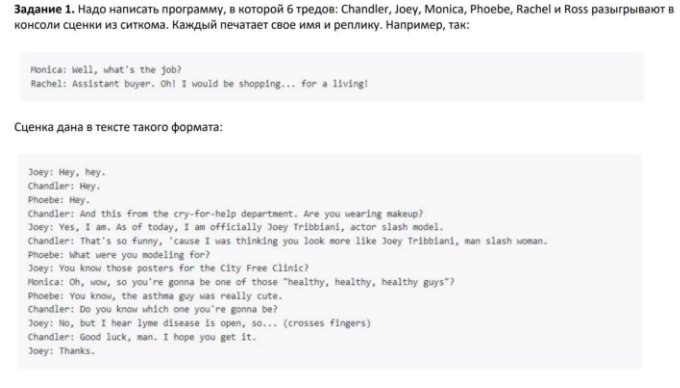

**Глава 1. Задание: Ситком** 

ФИО: Колупаев Сергей Алексеевич 

1. **Постановка задачи** 

В  условии  задачи  сказано,  что  в  программе  должно  быть  6  тредов, которые по очереди печатают свои реплики в консоль.  

Для реализации считывания сценария, который нужно будет разыграть, будем считать, что он должен быть загружен в текстовый файл. 

Сценарий состоит из n-количества реплик. Согласно образцу, данного в задании, будем считать, что формат одной реплики представлен в виде: 

|Имя Героя |: |Реплика |
| - | - | - |

Также будем считать, что реплика одного героя не имеет переносов на новую строку.  

Рис 1 Текст задания 

2. **Технологический стек** 

Язык программирования: Java.  

Система сборки для управления проектом: Maven. Библиотеки для тестирования: JUnit и assertj 

3. **Реализация** 

Первым  делом  был  реализован  класс   Actors,  объектами  которого являются каждый из героев ситкома. Полями данного класса являются имя актёра, набор его реплик в виде Queue<String> и текущее состояние. В данном классе переопределён метод run(), который будет выполнятся в отдельном потоке. Суть метода – постоянная проверка своего состояния и, при изменении состояния  на  TALK,  происходит  вывод   реплики  в  консоль  и  возврат  к состоянию WAITING.  

Также  был  реализован  enum-класс  для  инициализации  состояний каждого героя. Всего их два: WAITING и TALK.  

Далее было необходимо реализовать класс, обрабатывающий входный данные. В нашем случае, это сценарий, расположенный в формате текстового документа. Для этого был реализован класс ScenarioParser, в который, при создании  экземпляра,  помещается  путь  до  файла.  Итоговыми  значениями данного класса являются два массива типа List<Actors> и Queue<String>, в первом содержится список актёров, во втором, сценарий(последовательность имён актёров в том порядке, в каком они должны произносить свои реплики) 

Финальным классом, имитирующем сцену является класс ControlScene. Здесь  производится  инициализация  потоков  с  помощью  класса ExecutorService. В дальнейшем в каждый из потоков передаётся класс Actors. После чего из сценария достаётся поочерёдно имя актёра, который должен сейчас выводить свою реплику в консоль и его состояние переводится в TALK. После каждой реплики происходит небольшая задержка для синхронизации потоков. 

Также были реализованы два тестовых класса для проверки корректной работы классов ScenarioParser и ControlScene.  

Все тесты были успешно пройдены. 

Репозиторий проекта:[ https://github.com/Esi4/Musical ](https://github.com/Esi4/Musical) 
