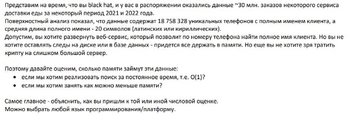

**Глава 1. Задание Black Hat** 

ФИО: Колупаев Сергей Алексеевич 

1. **Постановка задачи** 

Имеется следующий текст задачи, приведенный на рис.2.1 

Рис.  1.1 Текст задачи 

Из  текста  задачи  понятно,  что  требуется  провести  некоторые 

расчёты. 

Будем считать, что номера представлены в формате x-xxx-xx-xx) , где x – любая цифра. А имена могут состоять от 2 до 40 букв(в таком случае среднее количество символов одного имени будет 20, как описано в задании). 

Также будем считать, что номера телефонов будут хранится в строке ASCII. В таком случае, каждый символ будет занимать 1 байт. 

Также, в качестве языка программирования, будем использовать Java. 

2. **Аналитический метод** 

Для  начала  проведём  аналитические  расчёты  для  первой подзадачи, а именно: «Оценить, сколько памяти займут данные, если мы хотим реализовать поиск за постоянное время, т.е О(1)?» 

Т.к  задача  состоит  в  поиске  за  постоянное  время  O(1),  то  для выполнения такого условия подходит HashMap, где ключ - это номер телефона, а значение - это имя клиента.  

Согласно документации, объём ссылки пустого ключа в ячейке HashMap равен 4 байтам, а объём заголовка – 8 байт. Поэтому получим, что память для одного ключа будет равна объёму:  

11 символов по 1 байту (ASCII) + заголовок (8 байт) + 4 байта на ссылку = 23 байта. 

Тогда  объём  всех  ключей  будет: 23\*18 758 328=431 441 54423\*18 758 328=431 441 544 байта. 

Объём памяти для значений будем рассчитывать из того, что один символ  занимает  2  байта  в  кодировке  UTF-16.  Тогда  объём  одного значения будет: 

20 \* 2 + 8 байт заголовка + 4 байта на ссылку = 52 байта 

Тогда объём всех значений будет 52 \* 18 758 328 = 975 433 056 байта 

Также стоит учитывать Initial capacity HashMap, так как HashMap увеличивается  динамически,  и  для  избежания  частых  расширений выбирается  мощность  двойки,  то  данный  параметр  будет  равен 33 554 432. 

Отсюда нужно посчитать объём свободных ячеек. 

(33 554 432−18 758 328) \* 4 = 59 184 416 байта. 

В итоге получим, что общая память будет равна: 

431 441 544 + 975 433 056 + 59 184 416 = 1 466 059 016 байт(≈ 1.47 Гб). 

3. **Эмпирический метод** 

Реализуем в Java HashMap<String, String>, для хранения данных. А также реализуем методы для генерации случайных номеров телефона и имён  для  заполнения  HashMap  на  объём,  равный  18758328.  После запуска  и  мониторинга  показателей  памяти,  получим,  что, приблизительно,  при  возвращении  заполненной  HashMap,  объём оперативной памяти, выделенной для этой задачи, был равен 749,96 Мб:  

Рис.  1.2 Результат эмпирического метода 

Из возможных причин расхождения в расчётах можно отметить, что при генерации  случайных  имён,  итоговые  имена  были  объёмом  от  2  до  40 символов(т.к в задании сказано, что средняя длина – 20).  

Также это можно объяснить другими факторами, такими как: специфика JVM и уровень оптимизации. 

4. **Оптимизация** 

Вторая  подзадача  сформулировано  следующим  образом: «Оценить объём памяти занимаемых данных если мы хотим занять как можно меньше памяти».  

В  таком  случае  можно  изменить  систему  хранения  ключей.  В предыдущих пунктах считалось, что ключи хранятся как строки ASCII, но можно их хранить в виде чисел(long), тогда потребуется 8 байт для хранения номера телефона. 

Также можно минимизировать объём памяти, используя TreeMap, т.к в данном случае используется красно-черное дерево и потребление памяти  может  быть  ниже  из-за  отсутствия  необходимости резервирования дополнительных методов памяти для свободных ячеек. Но в таком случае расплачиваться придётся производительностью.  

В таком случае, итоговый объём в аналитическом методе будет равен,  приблизительно,  1.3  Гб(процесс  вычисления  тот  же,  что  и  у HashMap, но без расчёта объёма свободных ячеек).  при реализации через TreeMap эмпирический метод показал итоговый объём равный 734,32 Мб:  

Рис.  1.3 Результат TreeMap 

Время, затраченное на выполнение программы также увеличилось на 30%. 

Репозиторий проекта:[ https://github.com/Esi4/Black-Hat/tree/master ](https://github.com/Esi4/Black-Hat/tree/master) 
